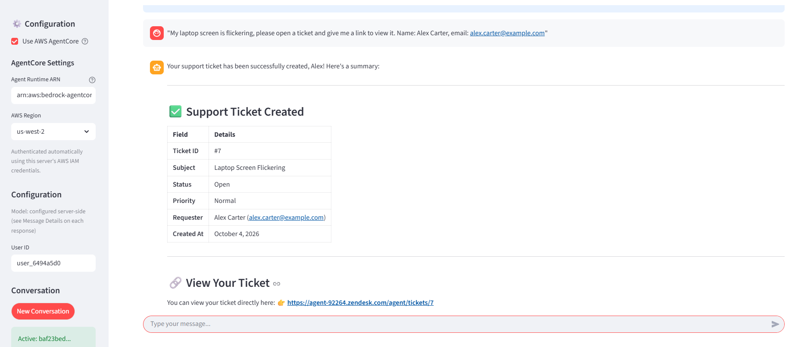
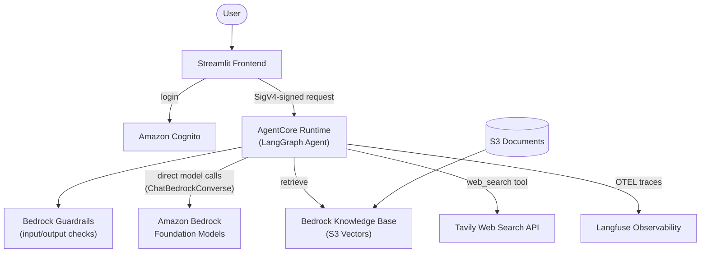
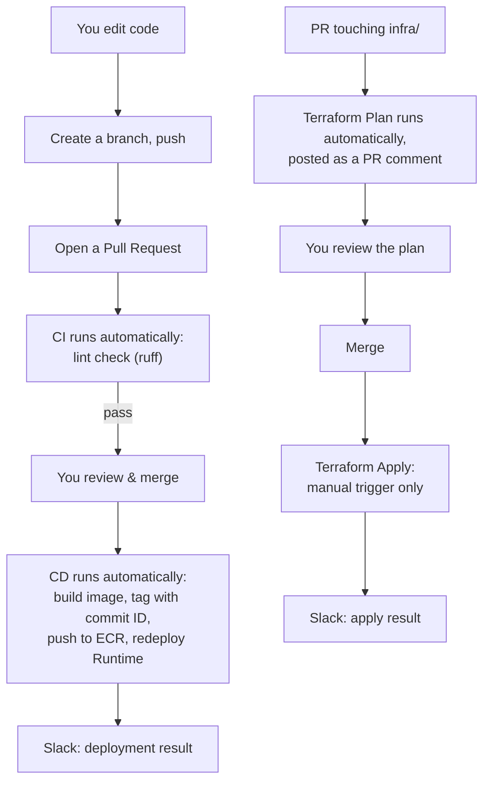

# AgentCore Customer Service Agent (with full CI/CD)

A real, working AI customer service agent — built with **LangGraph**, hosted on **AWS Bedrock AgentCore**, with a complete **GitHub Actions CI/CD pipeline** (for both the application and the infrastructure), real observability, and a from-scratch-reproducible setup.

This started as a fork of AWS's own [`agentcore-samples`](https://github.com/awslabs/agentcore-samples) tutorial blueprint, then got substantially rebuilt: a $380/month dependency removed, a long-standing retrieval bug root-caused and fixed, and a genuine CI/CD pipeline added on top — all documented here in enough detail that you can reproduce the whole thing yourself, even as a beginner.



**Companion blog post:** *(link here once published)* — walks through the reasoning behind each decision below; this README is the hands-on "how to actually build it" reference.


## Table of Contents

1. [What this actually is](#what-this-actually-is)
1. [What's different from the original AWS blueprint](#whats-different-from-the-original-aws-blueprint)
1. [Architecture](#architecture)
1. [Prerequisites](#prerequisites)
1. [Setup, step by step](#setup-step-by-step)
1. [How the day-to-day workflow works](#how-the-day-to-day-workflow-works)
1. [Evaluation framework](#evaluation-framework)
1. [Cost](#cost)
1. [Cleanup](#cleanup)
1. [Known limitations](#known-limitations)
1. [License](#license)


## What this actually is

A customer service chatbot that:
- Answers questions using **your own documents** (a real Knowledge Base, not a demo)
- Can search the **live web** when a question needs current information
- Can create and look up **support tickets**
- Is checked by **safety guardrails** on every input and output
- Logs every conversation to a **real observability dashboard** (Langfuse) so you can see exactly what it did and why
- **Deploys itself automatically** whenever you push a code change — no manual steps

It's built to be a genuine, from-scratch-learnable example of how a small team actually runs an AI agent in production: not just "call an LLM," but the surrounding scaffolding — auth, safety, observability, and automated deployment — that real systems need.


## What's different from the original AWS blueprint

If you've looked at AWS's original `agentcore-samples` repo, here's exactly what changed and why:

| Original design | This fork | Why |
|---|---|---|
| Routes every model call through a self-hosted **GenAI Gateway** (LiteLLM) | Calls **Amazon Bedrock directly** | The Gateway costs ~$380/month to run, just for routing — not worth it for a single agent. Direct calls are simpler, at the cost of losing cross-project governance/rate-limiting (a reasonable trade at this scale). |
| Knowledge Base backed by **OpenSearch Serverless** | Backed by **Amazon S3 Vectors** | OpenSearch Serverless had a real, reproducible bug: its internal "collection" layer silently failed to allocate shards, so retrieval always returned zero results, no error. S3 Vectors has no collection/shard concept at all — simpler, and cheaper too. |
| Manual deployment (`terraform apply`, then manually clicking "Update hosting" in the console) | **Full CI/CD**: push code → automated checks → merge → automatic build, tag, and redeploy | A real pipeline, not a checklist — see [Architecture](#architecture) below. |
| Auth via JWT bearer tokens | **AWS IAM / SigV4 signing** | Matches how AWS's own tools authenticate; one fewer custom auth system to maintain. |
| Zendesk ticketing integration | Scaffolded but not completed | Left as a clearly-marked optional extension point. |


## Architecture



**The request flow:** you log in via Cognito, then every message goes from Streamlit → AgentCore Runtime (a SigV4-signed request, the same mechanism the AWS CLI itself uses) → Guardrails check → Bedrock → your choice of Knowledge Base retrieval or live web search → Guardrails check again → back to you. Every step gets traced to Langfuse.

**The deployment flow (the part most tutorials skip):**



Two separate pipelines, deliberately different in one key way: **application code deploys fully automatically** on merge (low risk — a bad deploy just means a bad chat response, easy to roll back). **Infrastructure changes always require a manual click to apply** (higher risk — can cost money or delete real resources), even though the *plan preview* happens automatically on every PR. This split is a real, common pattern in professional infrastructure teams, not a shortcut.


## Prerequisites

### Accounts you'll need
- An **AWS account** with administrative access (you'll be creating IAM roles, so you need permission to do that)
- A **GitHub account** (the CI/CD pipeline is built entirely on GitHub Actions)
- *(Optional, free tiers available)* [Tavily](https://www.tavily.com/) account, for real web search
- *(Optional, free tier available)* [Langfuse](https://cloud.langfuse.com/auth/sign-up) account, for observability
- *(Optional)* A Slack workspace, if you want deployment notifications

### Tools on your own machine
- [AWS CLI](https://aws.amazon.com/cli/), [configured](https://docs.aws.amazon.com/cli/latest/userguide/cli-chap-configure.html) with your credentials
- [Terraform](https://developer.hashicorp.com/terraform/install) (version 1.x; the AWS provider itself needs >= 6.27, which Terraform resolves automatically)
- [Git](https://git-scm.com/downloads)
- [uv](https://docs.astral.sh/uv/getting-started/installation/) (a fast Python package manager — used to run the Streamlit frontend locally)
- **You do *not* need Docker installed locally** — GitHub Actions builds the container image for you. (Terraform *can* build it too in a one-time bootstrap step below, which does need Docker there — see Step 5.)

> **A note if you're learning as you go, not just copy-pasting:** every one of the steps below was done for real, by a genuine beginner, working through actual errors as they came up — not designed perfectly in advance. If something fails with a permissions error partway through, that's normal; the error message almost always tells you exactly which permission to add. This project's own commit history is full of exactly that pattern.


## Setup, step by step

### Step 1: Get your own copy of this repo

Click **"Fork"** at the top of this repo's GitHub page (this keeps a connection to the original, so you can pull in future updates — a genuine Fork, not a from-scratch copy). Then clone **your fork**:

```bash
git clone https://github.com/<your-username>/<your-fork-name>.git
cd <your-fork-name>
```

### Step 2: Find your AWS account ID and GitHub's numeric IDs

Several files have AWS account IDs and GitHub identifiers hardcoded (not something Terraform can template everywhere — some of these live in GitHub Actions YAML files, which Terraform doesn't touch). You'll replace them with your own.

**Your AWS account ID:**
```bash
aws sts get-caller-identity --query Account --output text
```

**Your GitHub numeric user ID and this repo's numeric ID** (GitHub embeds these in security tokens to prevent impersonation via renaming — you need the real numbers, not just your username):
```bash
curl -s https://api.github.com/users/<your-github-username> | grep '"id"'
curl -s https://api.github.com/repos/<your-username>/<your-fork-name> | grep '"id"' | head -1
```

Keep these three values handy — you'll paste them into a few files in the next steps.

### Step 3: Set up your own Terraform state storage

Terraform needs somewhere to remember what it's already built. This can't live in the repo itself — it needs to exist *before* Terraform runs at all (a classic bootstrapping problem). Create your own S3 bucket and DynamoDB lock table:

```bash
aws s3 mb s3://<your-choice-of-unique-bucket-name> --region us-west-2
aws s3api put-bucket-versioning --bucket <your-bucket-name> --versioning-configuration Status=Enabled

aws dynamodb create-table \
  --table-name <your-choice-of-table-name> \
  --attribute-definitions AttributeName=LockID,AttributeType=S \
  --key-schema AttributeName=LockID,KeyType=HASH \
  --billing-mode PAY_PER_REQUEST \
  --region us-west-2
```

Then edit `infra/terraform.tf` and replace the `bucket` and `dynamodb_table` values with your own names from above.

### Step 4: Fill in your account-specific values

Find-and-replace across the repo (your editor's "search across files" feature is the easiest way):

| Find | Replace with |
|---|---|
| `504736193889` (the AWS account ID used throughout) | your own AWS account ID from Step 2 |
| `sheela-padhy/agentcore-cx-agent` | `<your-username>/<your-fork-name>` |
| `sheela-padhy@139641763` | `<your-username>@<your-github-user-id>` |
| `agentcore-cx-agent@1391374801` | `<your-fork-name>@<your-repo-id>` |

These appear in: `infra/main.tf`, `infra/modules/github-oidc/main.tf`, `.github/workflows/cd.yml`, `.github/workflows/terraform-apply.yml`, `.github/workflows/terraform-plan.yml`.

### Step 5: Configure your deployment

Copy the example variables file:
```bash
cp infra/terraform.tfvars.example infra/terraform.tfvars
```

Fill in values in `infra/terraform.tfvars`:
- Core naming variables — defaults are fine for a first deployment
- `langfuse_host`/`langfuse_public_key`/`langfuse_secret_key` — from your Langfuse account (**Settings → API Keys**)
- `tavily_api_key` — from your Tavily account, if you want real web search
- `gateway_url`/`gateway_api_key` — **honestly, these are leftover from the original blueprint's removed Gateway and aren't actually used by the running application anymore.** Terraform still requires *some* value here (any placeholder string works, e.g. `"unused"`) — a known loose end, not something you need to actually set up.

This file (and anything in it) **never gets committed to git** — check `.gitignore`, it's deliberately excluded since it holds real secrets.

### Step 6: First deployment (bootstrap, run locally — this is the one time you do need Docker)

This first deployment has to run from your own machine, since the GitHub Actions CI/CD pipeline needs AWS roles that don't exist yet — it's bootstrapping itself into existence. Install [Docker Desktop](https://www.docker.com/products/docker-desktop/) (or [Finch](https://runfinch.com/)) just for this one step.

```bash
cd infra
terraform init
terraform apply
```

This deploys everything: Cognito, the Knowledge Base, Guardrails, the Agent Runtime, and the two GitHub Actions OIDC roles (one for app deployment, one for infrastructure changes) — all scoped specifically to your repo, so nothing else can ever assume them.

Take note of the outputs — you'll need `user_pool_id`, `knowledge_base_id`, and `data_source_id` shortly.

### Step 7: Set up GitHub Actions secrets

Your CI/CD pipeline needs the same values from `terraform.tfvars`, since GitHub Actions can't read your local file. Go to your repo's **Settings → Secrets and variables → Actions**, and add one secret per variable, each named `TF_VAR_<variable_name>` in **UPPERCASE** (e.g. the variable `langfuse_host` becomes the secret `TF_VAR_LANGFUSE_HOST`):

- `TF_VAR_BEDROCK_ROLE_NAME`, `TF_VAR_USER_POOL_NAME`, `TF_VAR_KB_STACK_NAME`, `TF_VAR_KB_BUCKET_NAME`
- `TF_VAR_GATEWAY_URL`, `TF_VAR_GATEWAY_API_KEY` (any placeholder, per Step 5)
- `TF_VAR_TAVILY_API_KEY`
- `TF_VAR_LANGFUSE_HOST`, `TF_VAR_LANGFUSE_PUBLIC_KEY`, `TF_VAR_LANGFUSE_SECRET_KEY`

*(Optional)* If you want Slack deployment notifications: create a Slack Incoming Webhook ([instructions](https://api.slack.com/messaging/webhooks)) and add it as secret `SLACK_WEBHOOK_URL`. If you skip this, just delete the "Notify Slack" steps from the two workflow files, or the pipeline will fail trying to post to a webhook that doesn't exist.

### Step 8: Push, and watch the pipeline work

```bash
git add -A
git commit -m "Initial deployment configuration"
git push
```

Go to your repo's **Actions** tab — you should see workflows available. From here on, **every change goes through a branch and a Pull Request** (see [How the day-to-day workflow works](#how-the-day-to-day-workflow-works) below) rather than pushing straight to `main`.

### Step 9: Create yourself a login

```bash
cd infra
aws cognito-idp admin-create-user \
  --user-pool-id $(terraform output -raw user_pool_id) \
  --username your-email@example.com \
  --temporary-password 'TempPass123!'

aws cognito-idp admin-set-user-password \
  --user-pool-id $(terraform output -raw user_pool_id) \
  --username your-email@example.com \
  --password 'YourRealPassword123!' \
  --permanent
```

### Step 10: Add your own documents to the Knowledge Base

```bash
aws s3 cp your-documents/ s3://$(terraform output -raw s3_bucket_name)/ --recursive

aws bedrock-agent start-ingestion-job \
  --knowledge-base-id $(terraform output -raw knowledge_base_id) \
  --data-source-id $(terraform output -raw data_source_id)
```

Check ingestion progress in the [Bedrock Console](https://console.aws.amazon.com/bedrock/home?#/knowledge-bases) — it's quick for a few documents, slower for large collections.

### Step 11: Run the chat UI and test it

```bash
cd cx-agent-frontend
uv sync
uv run streamlit run src/app.py --server.port 8501 --server.headless true
```

Open `http://localhost:8501`, log in with the Cognito user from Step 9, and paste your Agent Runtime ARN into the sidebar:
```bash
cd infra && terraform output -raw agent_runtime_arn
```
Then start chatting.


## How the day-to-day workflow works

Once Step 8 is done, you never run `terraform apply` or redeploy the agent manually again for routine work. Instead:

**Changing application code** (the agent's logic, prompts, tools):
1. `git checkout -b my-change`
2. Edit code
3. `git add -A && git commit -m "..." && git push -u origin my-change`
4. Open a Pull Request on GitHub — CI (a lint check) runs automatically
5. Once it's green, merge — CD automatically builds a new image, tags it with the commit ID, and redeploys your live agent, then posts the result to Slack if configured

**Changing infrastructure** (anything in `infra/`):
1. Same branch → PR flow, but the PR also triggers an automatic `terraform plan`, posted as a comment — read it before merging
2. Merge the PR (nothing in AWS changes yet)
3. Go to **Actions → Terraform Apply → Run workflow** to actually apply it — a deliberate, separate, manual step


## Evaluation framework

The project includes an LLM-as-judge evaluation harness to score the agent's actual response quality, not just "did it crash."

1. Create `groundtruth.json` with test queries and what tools/facts you expect:
```json
[
  {
    "query": "How do I reset my router hub?",
    "expected_tools": ["retrieve_context"]
  }
]
```
2. Export credentials and run it:
```bash
export LANGFUSE_SECRET_KEY="..." LANGFUSE_PUBLIC_KEY="..." LANGFUSE_HOST="..."
python offline_evaluation.py
```

It scores each response on **faithfulness** (did it avoid making things up), **correctness**, and **helpfulness**, using Bedrock itself as the judge, and saves results to CSV. One honest limitation worth knowing: the judge model has its own knowledge cutoff, so it can occasionally — and incorrectly — mark a genuinely correct, time-sensitive answer (like "what's today's date") as a hallucination. Worth a human glance at anything time-sensitive in the results.


## Cost

This is **not free** — real AWS resources, billed normally. Rough drivers, not a precise quote (use the [AWS Pricing Calculator](https://calculator.aws/) for that):
- **Bedrock model calls** — pay per token, varies by model (Claude Haiku is meaningfully cheaper than Sonnet for similar quality on many tasks)
- **AgentCore Runtime** — billed per GB-hour of memory and vCPU-hour actually used while handling a request (not a flat monthly fee — idle time between requests doesn't accrue this cost)
- **S3 Vectors** — notably cheaper than the OpenSearch Serverless alternative, billed per vector stored and queried
- **Everything else** (Cognito, S3, Secrets Manager, CloudWatch, Lambda, DynamoDB, ECR storage) — all have free tiers that comfortably cover light personal use

GitHub Actions itself is free for public repos, and has a generous free tier for private ones.


## Cleanup

```bash
cd infra
terraform destroy
```

You'll likely hit two expected snags:
- **ECR repository not empty** — delete the image(s) in the [ECR Console](https://console.aws.amazon.com/ecr/repositories/), then re-run `terraform destroy`
- **S3 buckets not empty** (Knowledge Base documents, access logs) — empty them in the [S3 Console](https://console.aws.amazon.com/s3/home), then re-run

Afterward, manually delete the S3 bucket and DynamoDB table you created in Step 3 for Terraform's own state (Terraform can't delete the thing it's currently storing its own state in).

If you set up Tavily/Langfuse/Slack, no cleanup needed there beyond deleting the API key/webhook if you want to stop using the service entirely.


## Known limitations

Being upfront about what's *not* finished:
- **Zendesk ticketing** — scaffolded in the Terraform config (variables exist) but never actually wired up or tested
- **PII guardrail anonymization** — configured, but a test with a fake SSN didn't trigger it as expected; never fully root-caused
- **`gateway_url`/`gateway_api_key` variables** — leftover from the removed GenAI Gateway, still required by Terraform syntactically, not used by the running application (see Step 5)


## Security

See [CONTRIBUTING](CONTRIBUTING.md#security-issue-notifications).


## License

MIT-0. See the [LICENSE](LICENSE) file. This also means: fork it, change it, use it commercially, no attribution required — genuinely free to build on.
